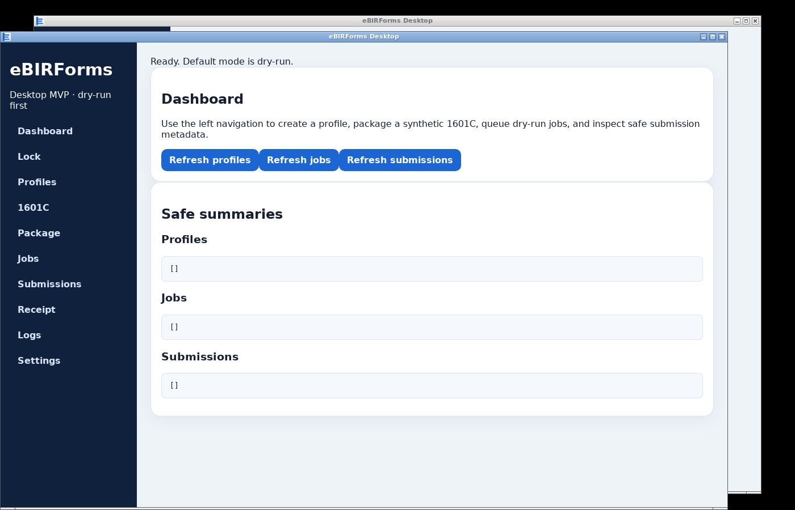

# eBIRForms Rebuilt Rust Workspace (OSS Sanitized)

Rust workspace for a safe-by-default, data-driven form rendering, packaging, queueing, and receipt-matching prototype. This OSS distribution uses synthetic fixtures only. It is not affiliated with, endorsed by, or certified by the Philippine Bureau of Internal Revenue (BIR).

## License

Licensed under the Functional Source License, Version 1.1, ALv2 Future License (`FSL-1.1-ALv2`). See `LICENSE`.

## Current scope

- `ebirforms-core::form`: synthetic 1601C rendering from JSON using `form.toml`, `mapping.toml`, and `template.xml`.
- `ebirforms-core::crypto`: deterministic compression/encryption/decryption transform used by tests.
- `ebirforms-core::package`: JSON → plaintext → encrypted artifact plus manifest.
- `ebirforms-core::submission`: safe-by-default dry-run/live-gated submission records.
- `ebirforms-core::job`: SQLite submission job queue.
- `ebirforms-core::profile`: local profile/settings/PIN app state.
- `ebirforms-core::receipt`: synthetic receipt parsing/matching and local directory polling.
- `ebirforms-cli`: command-line access to the above.

Only a synthetic 1601C fixture is included. Other forms require clean-room, redistributable templates/mappings.

## Build with mise

This repo includes `mise.toml` to pin Rust `1.75.0` and expose common build tasks.

On macOS with mise already installed, paste this into Terminal:

```bash
git clone git@github.com:xaviablaza/ebirforms-rebuilt-rs-oss.git 2>/dev/null || true
cd ebirforms-rebuilt-rs-oss
git checkout main && git pull origin main
mise trust && mise install && mise run build
./target/release/ebirforms-cli --help
```

The macOS binary will be at `./target/release/ebirforms-cli`.

## Desktop app

A Tauri v2 + Leptos desktop shell lives under `apps/desktop`. It wraps the existing Rust core through Tauri commands and provides a focused left sidebar with `Dashboard` and `Profiles`. The dashboard contains a Tax Form Library for `1601C`, `2000`, `2550Q`, `0619E`, `1601EQ`, and `1702Q`; package, queue/job, submission, and receipt actions are embedded in the selected tax form flow. The desktop tasks install the Rust `trunk` web frontend builder into `target/desktop-tools/` on first run and automatically add the `wasm32-unknown-unknown` Rust target for the active mise Rust toolchain.



On macOS with mise already installed, paste this into Terminal to build the desktop app:

```bash
git clone git@github.com:xaviablaza/ebirforms-rebuilt-rs-oss.git 2>/dev/null || true
cd ebirforms-rebuilt-rs-oss
git checkout main && git pull origin main
mise trust && mise install
mise run desktop-build
```

Development command:

```bash
mise run desktop-dev
```

Desktop check command:

```bash
mise run desktop-check
```

### Desktop demo walkthrough

A fuller presenter talk track lives in [`docs/desktop-tax-form-flow-demo-script.md`](docs/desktop-tax-form-flow-demo-script.md).

1. Launch: `mise run desktop-dev` or open the built app.
2. Confirm the sidebar only shows `Dashboard` and `Profiles`; the active profile is shown at the bottom-left of the sidebar.
3. On `Dashboard`, use `Tax Form Library` to choose a filing form and period. Supported demo forms are `1601C`, `2000`, `2550Q`, `0619E`, `1601EQ`, and `1702Q`.
4. Review or edit `Application data (synthetic JSON backing the XML)` and click `Save`.
5. Click `Validate`; explain that validation renders plaintext XML, encrypts/packages the payload, and locks the form for submission readiness.
6. Show package details on the form: filename, remote path, period, payload size, encrypted payload SHA-256, and payload path.
7. Click `Edit` to reopen the form if changes are needed, then `Validate` again.
8. Point out that `Print` remains disabled, while `Submit Final Copy` is gated by validation plus the `Final copy confirmation` checkbox.
9. Tick final-copy confirmation, then click `Submit Final Copy`; show that it queues and runs the dry-run job and enters a waiting-for-receipt state.
10. Click `Simulate received BIR receipt`; show the submission record changes to `Confirmed`.

Typical macOS bundle output path after a successful Tauri build:

```bash
apps/desktop/src-tauri/target/release/bundle/macos/eBIRForms Desktop.app
```

SHA-256 commands:

```bash
# CLI binary
shasum -a 256 ./target/release/ebirforms-cli

# macOS app bundle archive, after zipping it for distribution
zip -r ebirforms-desktop-macos.zip "apps/desktop/src-tauri/target/release/bundle/macos/eBIRForms Desktop.app"
shasum -a 256 ebirforms-desktop-macos.zip
```

Linux desktop builds require WebKitGTK/GTK development packages. Desktop tasks use Rust 1.88.0 via mise for Tauri v2, while the core/CLI crate still declares Rust 1.75 compatibility. macOS builds should be run on macOS with Xcode Command Line Tools installed.

Windows desktop build requirements:

- Windows 10/11
- Microsoft C++ Build Tools or Visual Studio Build Tools with the Desktop development with C++ workload
- WebView2 Runtime
- mise installed and trusted for this repo

Windows build command after prerequisites:

```powershell
git clone git@github.com:xaviablaza/ebirforms-rebuilt-rs-oss.git 2>$null
cd ebirforms-rebuilt-rs-oss
git checkout main; git pull origin main
mise trust; mise install
mise run desktop-build
```

On Windows, Tauri typically writes installers under:

```text
apps/desktop/src-tauri/target/release/bundle/msi/
apps/desktop/src-tauri/target/release/bundle/nsis/
```

## Commands

```bash
mise run test
mise run build
mise run render-sample
mise run package-sample

cargo run -p ebirforms-cli -- diff-fixture --form 1601C --input tests/fixtures/1601C/input.json --fixture tests/fixtures/1601C/synthetic_encrypted.xml
cargo run -p ebirforms-cli -- submit --form 1601C --input tests/fixtures/1601C/input.json --dry-run --records /tmp/ebirforms-submissions.json
cargo run -p ebirforms-cli -- queue --form 1601C --input tests/fixtures/1601C/input.json --dry-run --db /tmp/ebirforms-jobs.sqlite
cargo run -p ebirforms-cli -- run-queue --dry-run --db /tmp/ebirforms-jobs.sqlite --records /tmp/ebirforms-submissions.json --limit 1
cargo run -p ebirforms-cli -- jobs --db /tmp/ebirforms-jobs.sqlite
cargo run -p ebirforms-cli -- receipt-match --receipt tests/fixtures/1601C/receipt_accepted.txt --records /tmp/ebirforms-submissions.json
```

Default local state paths are under `.ebirforms/`, which is gitignored.

## Public-source hygiene

This repository intentionally excludes private fixtures, production credentials, endpoint research, and taxpayer data. See `SECURITY.md` and `DISCLAIMER.md`.
